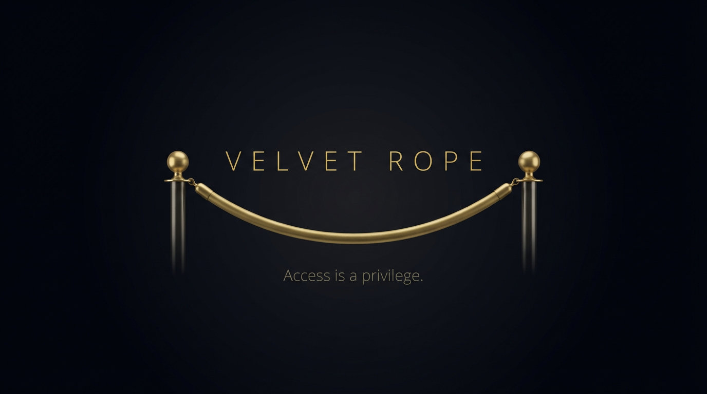
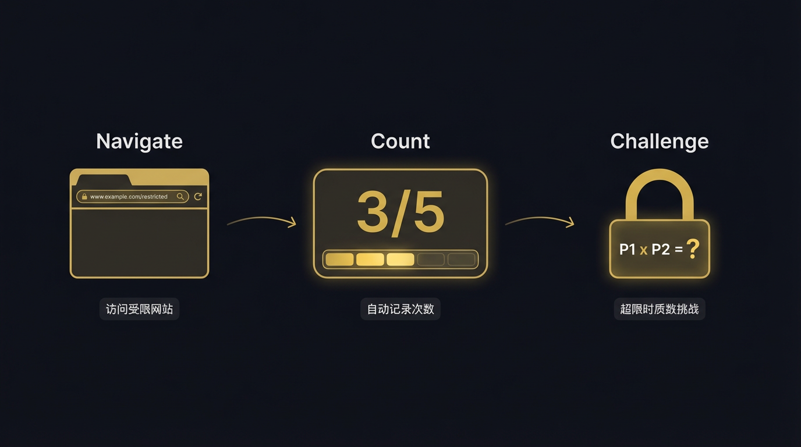

<p align="center">
  
</p>

<p align="center">
  <strong>A Chrome extension that curbs impulsive browsing.</strong><br>
  <sub>Daily visit limits + prime factorization challenges. Access is a privilege.</sub>
</p>

<p align="center">
  <a href="README.zh-CN.md">简体中文</a> | English
</p>

<p align="center">
  
  
  
  
  
</p>

---

## Why This Exists

You open your browser to look something up. Forty minutes later, you realize you've been scrolling through Reddit, YouTube, or Twitter the entire time.

The problem isn't visiting these sites — you genuinely need them. The problem is **losing control of frequency**.

Velvet Rope doesn't block any website entirely. It does one thing: **sets a daily visit limit for each domain**. Once you hit the limit, you'll need to solve a prime factorization challenge to continue — not to truly stop you, but to insert a **deliberate pause** between impulse and action.

> Like the velvet rope at a nightclub entrance: it blocks impulse, not intent.

<p align="center">
  
</p>

## Features

### Daily Visit Limits

Set a daily visit cap for any domain. Setting `reddit.com` automatically covers `www.reddit.com`, `old.reddit.com/r/xxx`, and all other subdomains and paths.

### Smart Counting

Counts visits at the **tab level**, not per page load. Browsing multiple pages within the same domain in the same tab counts as one visit — no inflated numbers. Page refresh does count as a new visit.

### Prime Challenge Gate

When you exceed the limit, Velvet Rope doesn't just show a "blocked" banner. It presents the product of two prime numbers and asks you to factor it.

- Default: 2-digit primes (~30-60 seconds of mental math)
- Configurable from 1 to 4 digits
- Correct answer grants +1 extra visit

The core idea: **not to block you entirely, but to create enough friction to make you ask "do I really need to open this right now?"**

### One-Click Quick Add

Click the toolbar icon, and it auto-detects the current site's domain. Set the daily limit in one step.

### Bilingual & Dual Theme

- Full Chinese / English support
- Dark / Light themes, switchable instantly in settings

## Installation

```bash
git clone https://github.com/WayneVoyager/velvet-rope.git
```

1. Open Chrome and navigate to `chrome://extensions/`
2. Enable **Developer mode** (top-right toggle)
3. Click **Load unpacked**
4. Select the cloned project directory

## Usage

| Action | How |
|--------|-----|
| Add a rule | Click toolbar icon → set daily limit → done |
| Check today's stats | Click toolbar icon to see all rules and usage |
| Manage rules | Click the gear icon in the popup → settings page |
| Access after limit | Solve the prime factorization challenge on the block page |
| Switch language/theme | Settings page → Global Settings → Language / Theme |

## Project Structure

```
velvet-rope/
├── manifest.json              # Chrome MV3 manifest
├── background/
│   └── service-worker.js      # Core: interception, counting, messaging
├── popup/
│   └── popup.html / js / css  # Quick-action popup
├── pages/
│   ├── blocked.html / js / css  # Block page (prime challenge gate)
│   └── options.html / js / css  # Rule management & settings
├── shared/
│   ├── i18n.js                # Bilingual string table
│   └── prefs.js               # Preference loader
├── icons/                     # 16/48/128px icons
└── docs/                      # Design docs & assets
```

## Design Philosophy

**Naming**: Velvet Rope — the stanchion rope at exclusive venues. It doesn't create confrontation; it implies an order: access is a privilege, not an unlimited commodity.

**Visual**: A hybrid of skeuomorphism and flat design. In dark mode, a near-black background with matte gold accents and layered cool grays. In light mode, a cold white base with navy-blue posts and golden rope. The rope barrier on the block page is the sole skeuomorphic element — a reminder that there is a gate here.

**Interaction Philosophy**: No attempt at strict lockdown (users can always uninstall the extension). Instead, it creates just the right amount of cognitive friction. The prime challenge isn't punishment — it's a ritual for reclaiming control over your attention.

## Technical Details

- **Manifest V3**: Service Worker instead of persistent background page, following Chrome's latest standard
- **Zero Dependencies**: Pure vanilla JavaScript + CSS, no frameworks, total size < 50KB
- **chrome.webNavigation API**: Precise navigation event monitoring
- **chrome.storage.local**: Persistent rules and visit logs
- **chrome.storage.session**: Session-level tab registry, auto-cleared on browser close
- **Auto Cleanup**: `chrome.alarms` triggers cleanup of logs older than 7 days every 24 hours

## License

[MIT](LICENSE)

---

<p align="center">
  <sub>Velvet Rope — one rope to reclaim your time.</sub>
</p>
